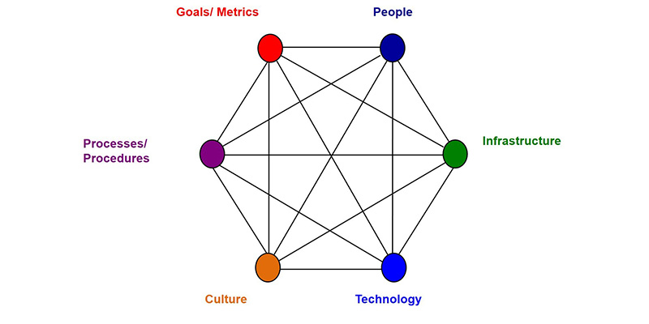
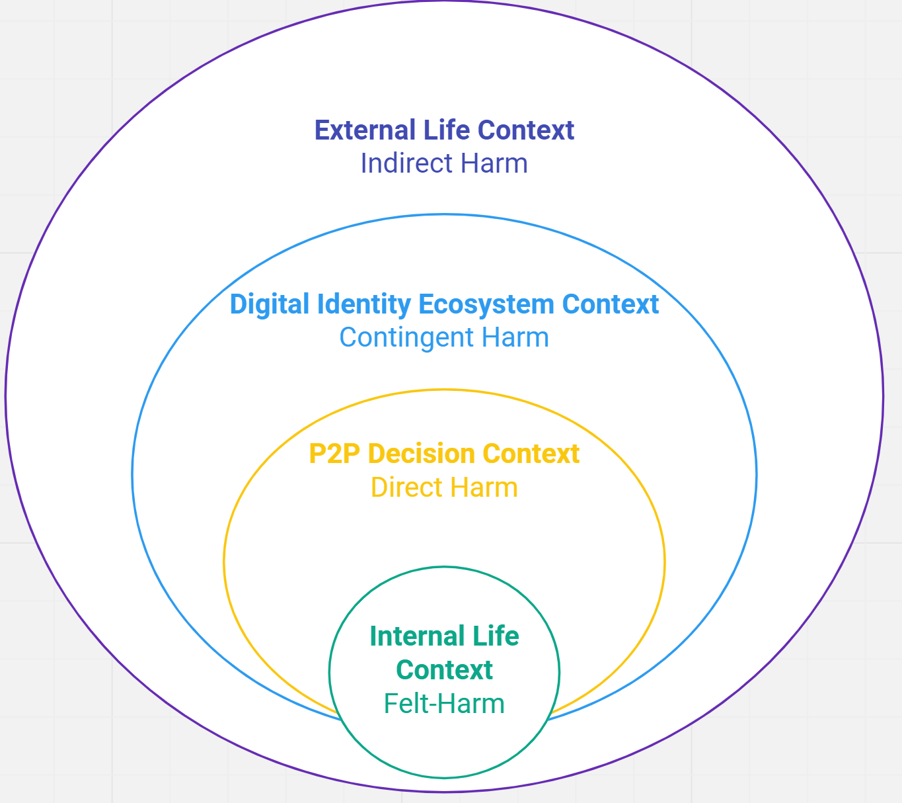
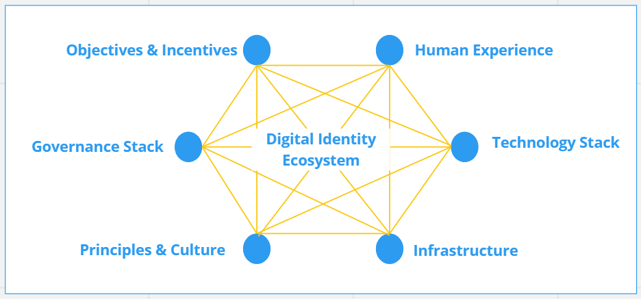
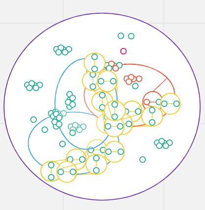

# Overcoming Human Harm Challenges in Digital Identity Ecosystems

Version 1.0 Draft for Public Review

16 November 2022

This publicly available white paper was approved by the Human Experience Working Group on 16 November 2022. The ToIP permalink for this document is:
https://trustoverip.org/permalink/Overcoming-Human-Harm-Challenges-in-Digital-Identity-Ecosystems-V1.0-2022-11-16.pdf

The mission of the [[Trust over IP (ToIP) Foundation]{.ul}](http://www.trustoverip.org) is to define a complete architecture for Internet-scale digital trust that combines cryptographic assurance at the machine layer with human accountability at the business, legal, and social layers. Founded in May 2020 as a non-profit hosted by the Linux Foundation, the ToIP Foundation has over 400 organisational and 100 individual members from around the world. Please see the end page for licensing information and how to get involved with the Trust Over IP Foundation.

#  Document Information

## Authors

Nicky Hickman, Phil Wolff - Wider Team, Pyrou Chung - East-West Management Institute

## Contributors

Aamir Abdullah - University of Colorado Law School; Christine Martin and Darrell O'Donnell - Continuum Loop; Jacques Bikoundou; Dr Jill Bamforth - Swinburne University of Technology; John Phillips and Jo Spencer - Sezoo; Kaliya Young - Identity Woman; Kim Hamilton - Centre Consortium; Oskar van Deventer and Rieks Joosten - TNO; Paul Knowles - Human Colossus Foundation; Sankarshan Mukhopadhyay - Dhiway; Scott Perry - Schellman

## Acknowledgements

The idea of a white paper on SSI Harms came out of the work of the Identity for All Council at the Sovrin Foundation. Sovrin's mission is 'Identity for All,' later discussed in a session at IIW in October 2021 entitled 'Power, Politics, Hamlet & Harms.' The key issues identified were: datafication, legal identification, and the colonisation of digital identity. The community discussion was moved to the ToIP Foundation's Human Experience Working Group to expand the scope. It remains a goal of this paper to ensure that those designing, developing and implementing SSI ecosystems always consider the impact on humans, particularly those who are marginalised, underserved or in vulnerable situations.

## Revision History

  | **Version** |  **Date Approved** |  **Revisions**
  | :-- | :-- | :-- |
  |1.0 |          16 November 2022 |   Initial Publication for Public Review|

## Text & Terms

There is a glossary for the paper, and all terms included in that glossary are highlighted in **bold** As many of the terms we will use are contentious, we are defining them here as they are used in this document:

- **digital identity** - a form of [digital data](https://essif-lab.github.io/framework/docs/terms/digital-data) that enables a specific entity to be distinguished from all others in a specific context. Identity may apply to any type of entity, including individuals, organisations, and things.

- **digital identity ecosystem** - A set of at least two (autonomous) [parties](https://essif-lab.github.io/framework/docs/terms/party) (members of the ecosystem) whose individual expressions of **digital identity** are recognised by other members, and whose individual work is of benefit to the set as a whole. Also known as a [digital trust ecosystem (DTE)](https://trustoverip.github.io/toip/glossary.html#digital-trust-ecosystem).

- **[self-sovereign identity (SSI)](https://trustoverip.github.io/toip/glossary.html#self-sovereign-identity)** - [Concepts/ideas](https://trustoverip.github.io/toip/glossary.html#concept), architectures, processes and technologies that aim to support (autonomous) [parties](https://trustoverip.github.io/toip/glossary.html#party) as they negotiate and execute electronic [transactions](https://trustoverip.github.io/toip/glossary.html#transaction) with one another. Also referred to as decentralised identity.

## Terms of Use

These materials are made available under and are subject to the [Creative Commons Attribution 4.0 International licence](http://creativecommons.org/licenses/by/4.0/legalcode]{.ul}](http://creativecommons.org/licenses/by/4.0/legalcode)).  THESE MATERIALS ARE PROVIDED "AS IS." The Trust Over IP Foundation, established as the Joint Development Foundation Projects, LLC, Trust Over IP Foundation Series (\"ToIP\"), and its members and contributors (each of ToIP, its members and contributors, a \"ToIP Party\") expressly disclaim any warranties (express, implied, or otherwise), including implied warranties of merchantability, non-infringement, fitness for a particular purpose, or title, related to the materials. The entire risk as to implementing or otherwise using the materials is assumed by the implementer and user.

IN NO EVENT WILL ANY ToIP PARTY BE LIABLE TO ANY OTHER PARTY FOR LOST PROFITS OR ANY FORM OF INDIRECT, SPECIAL, INCIDENTAL, OR CONSEQUENTIAL DAMAGES OF ANY CHARACTER FROM ANY CAUSES OF ACTION OF ANY KIND WITH RESPECT TO THESE MATERIALS, ANY DELIVERABLE OR THE ToIP GOVERNING AGREEMENT, WHETHER BASED ON BREACH OF CONTRACT, TORT (INCLUDING NEGLIGENCE), OR OTHERWISE, AND WHETHER OR NOT THE OTHER PARTY HAS BEEN ADVISED OF THE POSSIBILITY OF SUCH DAMAGE.

# Executive Summary

This paper provides a people-centric, human harms view on **digital identity ecosystems**. Balancing the huge effort to design systems for commercial, societal, or sustainable development impacts with a new perspective that seeks to understand how to design, develop, and operate **ecosystems** that mitigate and design-out human harms.

**SSI (Self-sovereign identity)** and other components and applications of the Trust over IP architecture were designed to mitigate many risks of human harms that occur in **digital identity ecosystems.** Still, these are only known risks and harms, and not new or emergent harms that come from the rapid pace of innovation in a fragile post-pandemic world. This paper explains how using **SSI** could mitigate or exacerbate those harms.

We can't design trustworthy **ecosystems** without considering them in the round. We must design both *for* the benefits and *against* harms. We must design for an ever-changing, dynamic, and evolving range of human harms. We must design now for what our trustworthy architectures and **ecosystems** may become.

There is a clear business case for public and private sector organisations in understanding and designing out harms and by proposing a systemic approach to harms mitigation. So on both moral and commercial grounds, we issue a call to action for technical and institutional efforts up and down the stack to protect and prevent where we can, and to intervene and mitigate together, when we cannot.

_Audience_ This paper is for all those engaged in the design, evelopment, deployment, operation, governance, and regulation of **digital identity ecosystems**, and all those seeking to build trustworthy services that depend on **digital identity.**

_Purpose_

-   Examine **digital identity ecosystems** from the perspective of the human harms challenges that can arise from the deployment of those systems irrespective of architecture
    
-   Name harms that **self-sovereign identity (SSI)** can create or exacerbate
    
-   Recommend a systemic approach and the business case for mitigating human harms
    
-   Identify next actions both inside and outside the ToIP community for overcoming human harm challenges with a specific emphasis on **decentralised identity ecosystems**

_Structure_

This paper is divided into three parts:

Part 1: PROBLEM DEFINITION - Uses a **PESTEL analysis** to examine the human harms of **digital identity** systems, and to explore how **SSI** can mitigate or exacerbate these harms, characterising them as:

1.  Political: Manipulation: Digital Identity and Democracy

2.  Economic: Datafication - Digital Identity as a Means of Production

3.  Sociocultural: Fragmentation: Digital Identity and Globalisation

4.  Technological: Innovation: Digital Identity and Efficiency

5.  Environmental: Dissociation: Digital Identity and Anthropocentrism

6.  Legal: Identification: Digital Identity as a Function of the Nation-State

Part 2: SYSTEMIC FRAMEWORK - Considers **digital identity ecosystems** not only as a **socio-technical system (STS)** but also as a **complex adaptive system (CAS)** and lists four ways harm functions in **digital identity ecosystems**: **Indirect harm** arising from the **external life context**, **contingent harm** arising from the **ecosystem,** **direct harm** arising from the **P2P decision context,** and **felt harm** arising from the **internal life context.**

Part 3: HARMS MITIGATION STRATEGIES - Recommends design for all aspects of a **socio-technical system** and four harms mitigation strategies:

1.  Improve **ecosystem** capability to recognize participants' vulnerabilities to **felt harm.**
    
2.  Foster the **agency** of all edge **parties** to help them protect themselves from **direct harm** within the **ecosystem**
    
3.  Balance the **power** held within the **ecosystem** to protect from **contingent harm**.
    
4.  Build the **ecosystem's collective resiliency** to protect from **indirect harm.**

The paper concludes that human harms cost businesses billions of dollars every year, and damage markets with two core next steps for overcoming human harm challenges in **digital identity ecosystems.**

> **harm** noun physical, mental or moral injury or damage. verb
> (harmed, harming) to injure physically, mentally or morally ETYMOLOGY:
> Anglo-Saxon *hearm*[^1].

# Introduction

Trust technologies are beautiful. Awesome. Brilliant. Transformational. Millions of organisations and billions of people have benefited fromparticipation in **digital identity ecosystems**. The proper design and
operation of **digital identity ecosystems** underpin every digital business and deliver commercial and societal benefits.

However, this is a human endeavour. There have always been hidden costs and many people hurt by **digital identity** systems. These harms are the subject of this paper. We'll share what can go wrong, some useful tools for thinking about those negative externalities, and an approach for us to live with them.

This is a first look, here at the Trust over IP Foundation, with the limits that come with a brief glance. That said, a few early takeaways:

-   Myths, precedent, experience, hope, and faith fill in gaps in our knowledge. Human harms that arise from **digital identity** are thought of as harms that mainly affect excluded, marginalised, or
    vulnerable people. Yet they can and do, affect everyone.
    
-   It's easy to assume harms from **digital identity** come from the same technology and user experience, just in the wrong hands, badly implemented.
    
-   The upside of **digital identity** is well mapped. Proponents consistently highlight and document its benefits. The underlying business model of how and why digital identity delivers those
    benefits is broadly understood. The negative externalities are much less well examined and documented; they are poorly understood. We lack a systemic model of how **digital identity's** human harms occur, and how to map them to existing ways for managing risks, costs, and negative externalities.
    
-   Understanding identity's human harms can create new opportunities for the success and resilience of all **digital identity ecosystems,** providing new insights on how to increase the benefits
    of those systems, simply by reducing the many risks and costs that come with harms.
    
-   The more we explore unwanted side effects from **digital identity ecosystems**, the more questions we have. It may take decades of international, interdisciplinary collaboration to find those
    answers, but this is a starting point.

To fulfil the ToIP upside mission, to "provide a robust, common standard and complete architecture for Internet-scale digital trust", we begin our exploration of the trust layer's downside. In doing so, we hope to play our part in answering the clarion call of Civil Society organisations in a recent letter to the World Bank: "*For too long, the emphasis has been on the development promises of digital ID systems, but it is past time to reckon with their vast potential for abuse and exploitation."*[^2] In doing so, we hope to create new opportunities for cross-community collaboration and interdisciplinary work to understand
how to detect, prevent and mitigate human harms thereby increasing the benefits and public goods from **digital identity ecosystems.**

#  Part 1: The Problem of Human Harms in Digital Identity Ecosystems

We can all recognise the **human harms** that arise from the presence or absence of identity systems. Most people have experienced this to a greater or lesser extent. For example, being refused entry to a building
because you cannot prove your right to enter, or being charged a higher price for a product or service because you are a tourist and not a local.

Sometimes these are inconveniences. For example, when you are denied access to an entertainment venue, or when a product's price increase is small to you. But some harms are severe. For example, when you are kept from a hospital that could save your life, or when surcharges are on your only source of food or water.

There is a lot of literature on both the benefits[^3] and dangers of digital identity[^4]. As with any powerful tool, badly made, poorly used or under the control of bad actors, the results can be catastrophic.
Recognition of these harms inspired the invention of **SSI.**

Even when you design the perfect identity tools, implement them perfectly, operate responsibly, you can still harm people. When **digital identity ecosystems** collide with the real world, great things happen.
Harms, too.

We can characterise the harms of **digital identity** using the **PESTEL** framework for business analysis:

-   Politics - Manipulation: Digital Identity and Democracy

-   Economics - Datafication: Digital Identity as a Means of Production

-   Sociocultural - Fragmentation: Digital Identity and Globalisation

-   Technical - Innovation: Digital Identity and Efficiency

-   Environmental - Dissociation: Digital Identity and Anthropocentrism

-   Legal - Identification: Digital Identity as a Function of the
    Nation-State

## Political: Manipulation: Digital Identity and Democracy
|  | I was shocked, it was like, this is not real. How could he find me guilty? When my release supervisor testified on the stand that; 'No, no-one told me anything, no-one told me I couldn't vote'. That right there should have been an open and closed case. But, it wasn't. It was very hurtful, it was almost like it was already planned. \[Crystal, USA, 2018 convicted of election fraud for voting on supervised release.\][^5] |
| -- | -- |

Although electronic voting is not widespread,[^6] digital systems are increasingly used in managing electoral systems and in managing relationships between governments and citizens. Social media is now a mainstream forum for news, political debate and campaigning. **Digital identities** in state or social media systems are used for political ends that weaken democracy and civil society. For example,

-   The myth of deliberate voter fraud used to justify increasingly complex voter identification and registration requirements and in some cases to criminalise political opponents (e.g. UK Elections Bill, USA state laws[^7]). This leads to disenfranchisement of large sections of the electorate.
    
-   Misinformation and election manipulation by state actors at a geo-political level, (e.g. Alleged Russian interference in 2016 USA presidential elections[^8]).
    
-   Social media's pseudonymity problem leading to a failure to balance freedom of speech and legitimate dissent with the harms of political polarisation, development of conspiracy theories, radicalisation and hate speech impoverishing political debate and undermining trust in political systems and liberal democracy.[^9]

### SSI Mitigations for Political Harms

**SSI** enables users like Crystal to take control of their **digital identity** and to selectively disclose attributes through verifiable presentations, so that attributes of a person's identity, for example (is a human, or is a voter) can be selectively shared and cryptographically proven pseudonymously or anonymously. For Crystal, this would have meant that verifiable credentials related to her voter status would change with the laws simply by revoking her voter credential during her supervised release. Because these credentials would be held and controlled by Crystal, as soon as there was a change like revocation, she would be aware of it and would be part of the revocation process.

The ability of **SSI** to give a verifiable and pseudonymous social media identity would make it more difficult for bots, conspiracy theorists and geo-political adversaries to manipulate social media systems. As a decentralised system, **SSI** also reduces the ability of any one party or actor to control the governance or operation of a igital identity system. This is most obvious in Decentralised Autonomous Organizations (DAOs), that use credentials or tokens to enable direct democracy and to achieve consensus within a **digital identity ecosystem** for governance changes.

### SSI Exacerbations of Political Harms

Use of technical means of governance enforcement, sometimes called machine readable governance, and the use of credentials or tokens in DAOs have a number of drawbacks. Firstly, this use of automation for governance can lack nuance because the strict application of rules is not moderated by contextual human judgement. Secondly, direct democracy can be combined with representative democracy (called liquid democracy), that uses delegation and tends towards certain actors who have higher stakes (financial or technical) to achieve their outcomes. Without the right checks and balances, and without fair and equal access to these systems there is a tendency towards 'mob rule' or political paralysis because consensus cannot be achieved.

## Economic: Datafication - Digital Identity as a Means of Production

|   | *These \[gambling\] companies know a staggering amount about their customers... They track their habits and patterns and vulnerabilities online to find out when best to advertise to them and what kind of emails they are most likely to open. They could, if they wanted to, use this information to help people, to block their accounts; but often they use it to drag them further into addiction.* (Annie, UK, 2021 wife of a recovering gambling addict who took his own life after being targeted by gambling companies) [^10] |
| -- | -- |

Datafication is *"the quantification of human life through digital information, very often for economic value."* [^11] Not only does the collection of data create harms like the invasion of privacy and surveillance capitalism, but so does the merging of disparate data sets, the use of automation and AI, and the policy, distribution, and crude use of machines to make decisions based on that data. As most of our **digital identities** are issued, orchestrated and controlled by commercial entities, harms arise because **digital identities** become
both the product itself and make human beings the units of production.

Of particular concern is that these harms impact unequally. They often entrench existing social and political biases, inequalities and vulnerabilities due to its propensity for 'social sorting'[^12]and the economics of behavioural advertising. A US Senate Committee found in 2013 that data brokers specifically targeted vulnerable customers for high-cost financial services. *A number of these products focus on consumers' financial vulnerability, carrying titles such as "Rural and Barely Making It," "Ethnic Second-City Strugglers," and "Retiring on Empty: Singles"*.

If **digital identity** is a set of data about an individual or a group of humans, then harms can occur if identity is the primary factor used to make economic decisions, or if the data is incorrect, or if the individual is already in a vulnerable position.

### SSI Mitigations for Economic Harms

Decentralisation is a core principle of **SSI**[^13]; the technology enables data to be stored at the edge of networks, on individuals' devices, with access controlled by the cryptographic keys that only the holder of the verifiable credential controls. This mitigates harms associated with datafication and productisation of human identities because the data cannot be used or accessed without the consent or
participation of the identity holder. Vulnerability and protection of those who cannot, for reasons of exclusion or vulnerability, control their **digital identities** are baked into the design through the
ability to delegate[^14] to **guardians** using verifiable credentials[^15].

Further mitigations are: (1) use of identity data doesn\'t necessarily require \"phone home\"; i.e. verification (a) doesn\'t need to contact the issuer OR (b) if it does, herd privacy can be used, AND (2) anti-correlation measures through the individual\'s ability to generate unique DIDs (vs reuse of identifiers across different credentials).

### SSI Exacerbations of Economic Harms

Most centralised or federated forms of digital identity can easily be assumed (your name is Robert; therefore, you are a man), inferred (people like you also watched this), self-asserted (never knowingly undersold) or fake (IS A BOT). Verifiable and trustworthy **digital identities** are difficult and complex to implement and often difficult and complex to use.

This friction is often problematic, as we have seen, excluding many users and introducing enormous costs and complexity to the business. With **SSI**, because it is so simple to verify a given attribute of an individual and because **SSI** can reduce friction in the user experience (e.g. passwordless login or eKYC) there is a risk that **SSI** will only accelerate datafication and supercharge it with verifiability. *"existing and new data guzzlers will be tempted to a data-maximalist approach. SSI makes it very easy to share highly sensitive personal information. It makes it also easy* for data *guzzlers to ask for more information than they strictly need".*[^16]

This risk is exacerbated versus existing risks because platforms and centralised systems are controlled by a single or small group of entities (normally organisations), decentralised systems are difficult, if not impossible, to do so. This easy verifiability means that where harms occur, the risks could be greater with **SSI** than with other forms of **digital identity.**

## Sociocultural: Fragmentation: Digital Identity and Globalisation

|  | *Not being able to get services. Not being able to reach your goal. Not being able to have even the basic things of life. Not feeling part of the society, feeling like an outcast.\[\....\] I was really, really angry. I was angry. I was almost depressed.\[\.....\] My second son will even say, 'are we criminals?'* Aisha, UK.[^17] |
| -- | -- |

Perhaps the biggest group of harms arises not with the presence of **digital identity** but with its absence. Many reports highlight the importance of diversity and inclusion for **digital identity systems**[^18]; further links with UNSDGs have accelerated investment and roll-out of **digital identity** systems linked with legal identification in low and middle-income countries. This has primarily been through the ecosystem around the World Bank's ID4D program[^19]. However, similar homogenic digital identity models have been implemented by governments worldwide, notably India's Aadhar programme.

This means that almost half the world\'s population, who are digitally excluded, are also increasingly excluded from almost every domain of human life. The majority of these people are women[^20]. This does not just affect those in the global south but also many living in advanced economies such as the UK, where a recent report found that 5.9m people (8.6% of the population) were "ID challenged"[^21]. This has had profound impacts on society, exacerbating inequalities and socio-economic exclusion.

Human identity, it is justifiably argued, is not a series of data points that once captured, can be fixed. It is dynamic, fluid and made up of complex social processes; the mere idea of expressing such a nuanced and subtle thing as human identity as a series of data items causes many harms, both intentional and otherwise[^22]. Furthermore, this systematic imposition of global norms and standards, together with globalisation, creates new tensions in individuals' and communities' psycho-social identities. Instead of a verb-like social process of becoming and belonging, digital identities objectify people and are a noun-like technical process of being and alienation[^23].

### SSI Mitigations for Social Harms

**SSI** recognises human identity as a social process because it is relational rather than nodal, every exchange of **digital data** begins as a P2P interaction with protocols such as DIDComm. The key feature of SSI is that it is not a technical system architecture but a **socio-technical system (STS)** architecture[^24].

|  |
| ---:|
| Figure: Components of a socio-technical-system |

This is best articulated in the Trust over IP twin stacks of governance and technology, with complementary standards, protocols and unifying design principles. The social component of the system is described as *"wet code"---the policies, procedures, rules, and laws that people write down and follow to create healthy, sustainable societies and economies*[^26].

Strenuous efforts have been made to explore and analyse the use of low-tech and no-tech connectors to digital systems to make **SSI** available for those who are digitally excluded. For example, using secure paper,[^27] biometrics, voice and **guardianship** credentials. Furthermore, the structures of verifiable credentials with an infinite, extensible variety of schema and credential formats enable the digital expression of different identity constructs depending on the cultural context of the transaction. "*This means that any institution, including kin-based and indigenous communities, could also use SSI to design credentials and issue them to their members on their own terms."*[^28]

**SSI** is better adapted to represent human identity because it has an **STS** architecture and a relational rather than nodal identity construct, that uses data exchange to facilitate a social process, rather than requiring a human to facilitate a technological one.

### SSI Exacerbations of Social Harms

**SSI** and the term "self-sovereignty" is born of a western philosophical tradition that prioritises individual agency, choice and freedoms. Yet in many non-western cultures the individual is subservient to the group, and individuals' identities are "sociocentric" rather than egocentric. In the sociocentric model, identity is defined as part of a complex web of relationships to other people and groups (e.g. clan, village, siblings), to other parts of the natural world (e.g. the land, animals, trees, rivers), to crafted things (e.g. jewellery, weapons), and to spirits (e.g. ancestors, spirit guides).

Although **SSI** allows for the identity of organisations and of **things**, identity of individuals is still separate from that of organisations, still separate from ancestors and still separate from **things.** There is a focus on individual autonomy and control in SSI that relies on a concept of individual agency and free will, and a denial of determinism that creates sociocultural harms by denying interrelatedness that is at the heart of many non-western conceptions of sociocentric identity. **SSI** may therefore compound the societal harms of **digital identity** by focusing on the decisions and agency of an individual, rather than those of a sociocultural group.

## Technological: Innovation: Digital Identity and Efficiency
|  | *The evening of Nov. 20, 2017, was perfectly ordinary: Our family sat watching reality TV and laughing together before heading to our bedrooms and saying our usual "see you tomorrow morning" to each other. Later that night, alone in her room, my 14-year-old daughter Molly connected to the Internet one last time --- including logging on to Instagram, where she'd been pushed into a rabbit hole of depressive content --- and then took her own life.* (Ian Russell, UK)[^29] |
| -- | -- |

As seen in the political, social and economic realms, most human harms arise from the objectification of entities, that is the creation of a record, a 'thing', the first technology that was used for this purpose was paper. Paper-based identity, (e.g. birth certificate, passport or membership card) was an emergent property of the transition from kin-based to institution-based social organisation; *"to interact with an institution and its systems, people must represent themselves in a way that is understandable to the institution or more precisely to a person who is acting in a role with that institution. This is done by producing documents issued to the person by either that institution or another institution whose authority they accept.*"[^30]

**Digital identity** makes the paper process more efficient by reducing the need for human intervention to destroy, change or exchange. This almost completely separates the social process from the technological one. Some go further, regarding digital technology itself as a tool of violence and enslavement.[^31] The speed of innovation in technological developments, the blurred lines between physical and logical worlds exemplified in the blended realities of the metaverse and the blurred lines between man and machine in an age of algorithmic automation; all contribute to new attack surfaces for bad actors, and compound harms through the very network effects that technologists seek to deliver for their business owners and investors. These harms are distinguished by their viral effects and their impact on real-world human behaviours and real-world human psychology and physiology.

Two particular examples demonstrate these harms very starkly. Firstly, the exponential growth in online child exploitation and sexual abuse (CESA) caused by *Platforms' features and business models \[which\] actively promote CSAM \[Child Sexual Abuse Material\] generation*. *Recommendation systems seamlessly connect adults with a sexual interest in children with potential victims.* (O'Connell & Curtis, 2022). Recommendation systems depend on digital identity for their efficiency in building advertising audiences and for maintaining the attention of those audiences. This changes real-world behaviours of both abusers and their victims, who in turn become prematurely sexualised at increasingly earlier ages leading to sexual violence in schools and a host of mental health harms.[^32]

The second example is state orchestration of technology by authoritarian regimes to coerce or control entire populations, sometimes of their own, for example, China[^33], and sometimes of others, for example, state sponsored cyberattacks. These actors seek to change offline behaviours in the name of bureaucratic efficiency and national interests.

### SSI Mitigations for Technological Harms

Decentralisation, distribution, portability, and the use of consensus in social (governance) and technical aspects of **SSI** as an **STS** are the primary mitigations of technological harms, preventing the take-over of the system by any one actor, and keeping both data and compute at the edge rather than in the control of a single actor such as an institution, or group of actors. Furthermore, the requirement in **SSI** for holders' consent and participation in transactions means that many of the technological harms that come with separation of the technical from the human process, are mitigated by **SSI**. A **digital identity** system that uses **SSI** is not a platform facilitating transactions in a market, but a network facilitating cooperation and communication in an **ecosystem** of peers. 

### SSI Exacerbations of Technological Harms

Technology and science are never neutral, and once in the world and subject to market forces, they cannot be controlled by their inventors. Wars, games and competitions are an important part of many cultures, they advance technology and science, and this is the case in the **digital identity** market as with any other. **SSI** could exacerbate technological harms at scale: Firstly, there is a race to drive adoption, this is necessary for the economic survival of those building and implementing **SSI** solutions and means that all the innovation pressures of shipping a Minimum Viable Product (MVP) and speed to market are even starker.

**SSI** and in particular the use of blockchain technologies, are even more untested, still a 'work in progress'[^34], and present even greater potential risks of large-scale technological harms including those of surveillance and abuse of human rights because ---*"blockchain is anything but private by design"*[^35]. The **SSI** community has made efforts to devise both technical and governance protections from these harms[^36] and to raise awareness of risks of projects such as Soul-Bound Tokens that put personally identifiable information (PII) on immutable ledgers.

Secondly, **SSI** is a predominantly an open, standards-oriented technical community focused on the work of creating technical standards and product development. The work of social scientists, creatives, legal experts, natural scientists, policymakers and laymen, is not typically part of these standards or product development processes. This leaves many gaps in the **STS** design, and leaves little room for alternative approaches to mitigate technological harms. Furthermore, as a largely voluntary community contributing to the development of **SSI** infrastructure, it is a community that has a distinct environment, culture, language, and long-term vision, but relatively few resources exposing it to unique risks.

Finally, if we accept Floridi's view, that human dignity and identity are rooted as much in our 'informational selves', as in our physical ones[^37], and given the importance of **digital identity** as 'critical infrastructure'[^38]and as a public utility, then we must also recognise that **SSI** lacks backup, an insurance model, and key connections to other aspects of infrastructure. Keys, applications and data that are stored in edge wallets or in the cloud for those without digital access themselves and largely under the governance of private sector organisations, pose new risks of human harms at scale. If edge devices are lost, or if a Layer 1 network fails due to a cyberattack, or an act of god or indeed war, or if an individual loses their capacity for example due to an accident, or the onset of dementia; then impacts of exclusion and of a kind of digital statelessness will create new technological harms at scale.

## Environmental: Dissociation: Digital Identity and Anthropocentrism
|  | *"This practice is a legacy that has been handed down by ancestors. The Kiau people believe that the forest is guarded by spirits and when entering the forest, the* mamatang[^39] *ceremony will be conducted to ask for permission to do activities or take forest resources. While* boros puru[^40] *will be the mode of communication throughout their time in the forest. This practice is also a practice of the Dusun Kiau community and we believe that if the forest disappears, then* mamatang *and* boros puru *will disappear or part of the Dusun Kiau identity will be lost."*    *"It is one of the oldest forms of 'free, prior and informed consent' to the spirits or guardian, especially whenever the person wants to open a land for agriculture for example. When we open the area, we usually will be given a sign through a dream. If bad dreams signify that the site is unsuitable, and a new one is sought. Not only dreams but we also look into other signs such as for certain animals (e.g: rat), reptiles (e.g: snake) and insects (e.g: millipede) which also indicate unsuitability of the field."* \[Mojelle Musin, Youth representative of Kiau Dusun People, Malaysia\] [^41] |
| --- | --- |

All peoples construe at least part of their identity in relation to their natural environment, very often this relates to land and places. In most foundational and legal identity systems that form the basis of **digital identity** systems for humans, key attributes, claims or credentials are the place or country of our birth and the places where we live, or own. Once transferred to the digital realm, this ignores many fundamental relationships with both land and the natural world that undermine many peoples' identities as we see in Mojelle's comments.

**Digital identity** systems are fundamentally anthropocentric, so that as long as human identities cannot be associated with lands and territories then they contribute to preventing self-determination rights afforded under international laws and conventions for Indigenous Peoples[^42]. Furthermore, the separation of geospatial datasets from those related to human identities, contributes to the dissociation of people from lands contributing to environmental harms and a form of ethnic cleansing that particularly impacts Indigenous Peoples. Holistic notions of ecosystems as a \'person\' or \'being\' are beginning to be recognised in territorial laws of some countries such as India, New Zealand and Australia where rivers have been afforded personhood, but here again, they remain dissociated from the identities of the Indigenous Peoples whose identities are tightly bound up with their environment.

### SSI Mitigations for Environmental Harms

SSI is one of the only digital identity architectures to be specifically designed from the outset to give equivalence to identity for people, organisations and **things**. The Sovrin Glossary, and mental models for entities specifically call out the difference between **man-made things** and **natural things**. This means that relationships between people and **natural things** can be represented in **SSI** and can support diverse expressions of human identity in relation to the natural world in different legal, social, religious or cultural systems.

Examples of initiatives using SSI to mitigate environmental harms: 

-   Indigenous Data Sovereignty initiative, East-West Management[^43]

-   EarthState, supporting the Tokenised Earth Economy [^44]

-   Energy & Mines Digital Trust, Government of British Columbia digital credentials carbon accounting pilot,[^45]
    
-   Āhau is a Whānau Data Platform that helps whānau-based communities whānau, hapū, Iwi) preserve indigenous identity within whānau managed systems[^46]
    
-   DignifID Animals Foundation using SSI to describe relationships between people and animals as pets and protected species for the specific purpose of promoting their wellbeing.[^47]

### SSI Exacerbations of Environmental Harms

As previously discussed in the section on sociocultural harms, despite the fact that **SSI** allows for the verifiability of multifarious relationships between people, organisations and **things**, **SSI** is still anthropocentric and may exacerbate dissociation because it forces the identification of **natural things** as separate entities from people.

There is also still within the **SSI** community a focus on 'authoritative issuers' and organisations that have a legal identity. This means that the self-assertion of relationships with the natural world by individuals or informal groups without a legal organisational identity, are not recognised, and we still separate their fate, as in the case of the Dusun people and the forest.

Any digital identity system has environmental costs associated with the consumption of carbon and natural resources (e.g. rare earths, metals), however some **SSI systems** that rely on proof-of-work blockchains for their decentralised identifiers (DIDs), are especially energy-intensive. Although many are moving towards proof-of-stake to reduce this carbon footprint, the bald fact is that if you rely on the lots of nodes holding the same data, instead of one centralised system, then the energy consumption is likely to be higher.

## Legal: Identification: Digital Identity as a Function of the Nation-State

|  | A former military commander still in Afghanistan said that \[the\] Taliban detained him for twelve days in November and took his fingerprints and scanned his irises with a data-collection tool. "They told me they took my fingerprints to check if I was military and if they could confirm it, they would kill me" [^48] [^49] |
| --- | --- |

In 2017, the UN detailed specific targets associated with their [[Sustainable Development Goals]{.ul}](https://sdgs.un.org/goals) (UN SDGs), one of these goals is 'Peace, Justice & Strong Institutions' and one of the specific targets is 16.9: *"by 2030 provide legal identity for all including free birth registrations."* There are excellent reasons for this that go to the heart of why human identity is important: it enables the recognition of personhood and inherent human rights in a civil society, obligations of the state and responsibilities of the individual to pay taxes and comply with the law. Recognizing personhood gives people access to vital services such as healthcare, education, justice, employment, and travel. This has led to a flourishing of national digital identity systems and an indelible link between digital identity and legal identification.

The digitisation of legal identity is no doubt essential for human rights, social justice, and the accountability of national governments to their citizens and vice versa. For many, it is a boon, simplifying access to vital public services and reducing public sector costs. However, severe harms may potentially arise because:

-   Access to services can become dependent on having a digital identity, excluding all those who are digitally excluded (about half the world's population)

-   There is often leakage from public sector systems into commercial data ecosystems, For example: an investigation by Human Rights Watch found that 89% of government-endorsed edtech *"appeared to engage in data practices that risked or infringed on children's rights.... Most online learning platforms examined installed tracking technologies that trailed children outside of their virtual classrooms and across the internet, over time. Some invisibly tagged and fingerprinted children in ways that were impossible to avoid or erase"*[^50]

-   Because legal identification confers obligations and costs on states, some states restrict access to national identity systems. This restricted access leaves many stateless, e.g. children born in refugee camps or Indigenous People whose homelands traverse national boundaries.

-   Biometrics are often used to bind a single human to a what is called a digital identity, but is more often than not a record in a database. Biometrics themselves come with their own sets of security risks and privacy harms.

**Digital identity** is not legal identity defined by the UN as *"the basic characteristics of an individual\'s identity. e.g. name, sex, place and date of birth conferred through registration and the issuance of a certificate by an authorized civil registration authority following the occurrence of birth"*[^51]*,* but due to the UN SDG and the canonical examples of documented identity such as passports, driving licences and birth certificates, many see **digital identity** and read legal identification. In other words, although many **digital identities** are representing a legal identity, most are not, they are social identities (e.g. facebook connect), or device identities (e.g. mobile 'phone, browser), work identities (e.g. alice@acme.com)

As a function of the nation state legal identification is inevitably politicised as governments of all colours and persuasions seek to meet policy goals and meet their international obligations. This one-dimensional view of a person's identity undermines their fundamental human dignity[^52] by denying personhood to those who are excluded. Research shows "*many of the systems studied and assessed have been linked to actual and prospective, serious and large-scale violations of human rights"*[^53].

### SSI Mitigations for Legal Harms

One of the main reasons that legal identification has become increasingly bound with **digital identity** of humans is the need for the trustworthiness of **digital identities** in transactions that carry weight or value. In centralised or federated models of **digital identity**, the verifier (consumer) of a **digital identity** must be able to have a relationship with the issuer of the **digital identity**, be able to consume that form of **digital identity**, and have confidence in its contents (data). These factors combine to limit the field of the types of organisations who can most effectively act as an issuer to large organisations with sufficient market or legal power to set the rules, or those with sufficient reach to have relationships with most people in their jurisdiction. Governments naturally fall out as primary issuers for these reasons. **SSI**-based architectures enable the creation of searchable registries that can cryptographically verify data. This pattern removes the need for the verifier to have a direct relationship with the issuer, enabling a verifiable proof of personhood without state-issued legal identification.

**SSI** also enables a person to 'be represented by any number of digital identities'[^54] from any number of issuers so that there is not any single point of failure (the 'one ring' problem); this provides options and a failsafe against in case of the misappropriation of **digital identity** infrastructures by bad actors.

### SSI Exacerbations of Legal Harms

**The term self-sovereignty has political connotations.** The use of the term 'self-sovereignty' is translated as a direct anarchic challenge to settled forms of national sovereignty. This falsely picks a fight between the sovereignty and autonomy of individual people versus the sovereignty and self-determination of groups of people, usually in the form of an institution of the state. For many this either directly aligns **SSI** with the regulatory 'wild west' of Web 3.0 and crypto-currencies, or it suggests a naive belief in human capacity and capability to be self-sovereign. 

**Self sovereignty can be too comforting.** Furthermore, **SSI'**s lack of a central authority means that any system can claim to be **SSI** with a tendency to focus only on user control, creating implementations that effectively are less transparent because they pretend to be controlled by users but are not; *"In fact, it can create a false sense of safety and security that actually puts people at heightened risk."*[^55] Translating **SSI** into existing centrally controlled identity systems as a technical substitute rather than a full interpretation of what it means to implement a new socio-technical system with re-aligned incentives, open and transparent governance, and respect for human rights can only exacerbate the existing harms of those systems.

# Part 2: A Framework for Understanding Human Harms

We can see from the **PESTEL** analysis that **human harms** arising from **digital identity** systems, with or without **SSI**, are not all the same, but have some common characteristics. We can also see that the harms occur depending on *who* uses the system, and the *purpose* of its use, the harms do not occur within the digital system, rather there are consequences in the real world, for real people like those in our examples in Part 1. In order to develop mitigation strategies, we now propose a simple framework for characterising human harms with their context and characteristics.

## Different Types of Harm in Different Contexts

The diagram below is one way of framing human harms. The model identifies four types of harm depending on the real-world context (**external life** and **internal life**) that encompass the blended
reality of the **digital identity ecosystem** context and, within that, the **P2P decision context**.

The four types of context and their types of harms are:

1.  **Internal life context.** The psychological and spiritual world, of thoughts, stories, memories and emotions across space and time. Sources of harm are internal shocks, trends or changes. e.g. mental or physical illness, changes in family relationships, e.g. death of a loved one. The harms experienced in the **internal life context** are **felt harms**. **Felt harms** have behavioural, emotional or psychological impacts e.g. the story of Molly Russell, driven by social media algorithms to take her own life. An example of disconnection from belonging - artificial algorithm generation of social space - causing the psychological harm of identity displacement.

2.  **External life context.** The world outside of ourselves, the physical and natural world, other people, organisations or things. Sources of harm from this context include shocks and trends or changes, such as pandemics, deforestation, war or climate emergency. The harms experienced in the **external life context** are **indirect harms. Indirect harms** have physical impacts and the people who are harmed have no influence or power over the circumstances or events that lead to that harm. An example of this is the story of the Afghan soldier, who was threatened with death if identified as a consequence of the Taliban takeover.

3.  **Digital Identity Ecosystem context.** A set of at least two (autonomous) [parties](https://essif-lab.github.io/framework/docs/terms/party) the
    members of the ecosystem) whose individual expressions of **digital identity** are recognised by other members, and whose individual work is of benefit to the set as a whole. Sources of harm in the
    **ecosystem** context are the misalignment of **objectives** or **incentives** between **parties** in the **ecosystem**, the consequences of **actions** or **interactions** between other **actors** in the ecosystem, loss of digital access, and a failure of **governance** or technology to function as expected. The harms experienced in the **ecosystem** are **contingent harms.** Impacts of **contingent harms** are **ecosystem** decay affecting all **parties** in the **ecosystem** and breakdown of **relationships** leading to loss of interoperability with other **digital identity ecosystems,** e.g. the story of Luke Ashton, subject to gambling adverts because of the business transactions between gambling companies and ad networks.

4.  **P2P Decision context.** Single or chained interactions or transactions that may be online or offline, i.e. **trust tasks** such as the exchange of **verifiable credentials.** The primary sources of harm in this context are an imbalance of power between the **parties** in the transaction or conflicting **objectives** of
    the **parties,** e.g. one is a bad actor, or a failure of **governance** or technology. The harms experienced in this context are **direct harms**. **Direct harms** result in a failure of asset or value exchange, unintended loss of assets for the harmed **party,** intended or unintended asset gains for the other
    **party** in the transaction, e.g. Aisha's story, unable to get a bank account or job because of the immigration policies of the UK government.

||
| --:|
|Figure: Four types of harm arising from, and impacting humans in, different contexts |

## Common Features of Harms

These four categories of harm (direct, indirect, contingent and felt) arise from different contexts, have different sources and different types of impact. They have seven common features.

1.  Harms connect and cross blended realities.

Digital identity harms are also human dignity harms, risks to livelihoods and lives. Human harms are always experienced in both **external** and **internal life** **contexts** so that physical and digital systems must be designed together.

2.  Harms are contagious

Harms spread. They are infectious and transfer across contexts and to other parties. Human harms are interconnected and often chained, spreading virally.[^56]

3.  Few harms are rivalrous

Harms are rarely the result of a zero-sum game where one party must lose or be harmed for the other party to win benefits.

4.  Identity harms compound other harms

They can exacerbate exclusion and other vulnerabilities. For example, the **felt harm** that Aisha and her son experienced 'feeling like a criminal' was the result of a **direct harm,** and this compounded Aisha's vulnerabilities due to her gender, ethnicity and immigration status. Similarly, the **direct harm** created by dissociation from the forest experienced by the Dusun people resident in those forests, created a **contingent harm** for Dusun people in other locations due to loss of language related to the forest context. loss of identity through deforestation for the Dusun people. This suggests that we need to be able to recognise vulnerability.

5.  Harms unequally affect different people

Both Molly and Luke took their own lives, and both were (thankfully), outliers. Other teenage girls and recovering gambling addicts may well have similar, harmful digital experiences, but the impact and
consequences on them is not as extreme, it is simply unequal.

6.  Identity harms may be unwitting

Most harms are unintentional, especially **felt-harm**.[^57] They can be accidents of system design or emergent properties of a complex system. For example, it was not the intention of those that designed the Afghan National Identity System to facilitate the summary murder of the many thousands of Afghani soldiers they had trained, nor to increase the efficiency and efficacy of the Taliban takeover.

7.  Identity harms inherit complexity from the ecosystems that produce them

These common features suggest that **digital identity** systems, part of **digital identity ecosystems,** are themselves **Complex Adaptive Systems (CAS).** They are also interconnected with many other natural, social, economic, political, and technological systems. This means there are emergent properties and adaptive evolution that result from the use of **digital identity** systems.[^58]

#  Part 3: Harms Mitigation in Digital Identity Ecosystems

We have seen how **digital identity** creates political, sociocultural, economic, technological, environmental and legal harms that interoperate and are interdependent. Addressing one harm may unwittingly give rise to new harms or exacerbate others.

In short, **digital identity,** our 'informational selves' cannot be separated from our human identities; *"my data as in my lungs, my liver, my eyes. They\'re mine as in they make me who I am, they are constituting of myself. Now we\'re moving increasingly towards a 'my data' in a constituting position, as my organs for example,".*[^59]

This perspective requires us to reconsider how we could design **digital identity** systems around people, rather than trying to change human behaviour to support technical or institutional processes. There are five strategies that we have identified for designing **digital identity ecosystems** that prevent harms and promote benefits.

## Design for all aspects of a Socio-Technical System (STS)

Identity systems are part of a series of interconnected and nested **complex adaptive systems.** But the human side is a 'natural' system we can only adapt to. We cannot shape human nature or redesign culture.

The diagram below shows how aspects of a standard organisational **STS** could be re-named as aspects of a **digital identity ecosystem**. To be clear, a **digital identity** system is one system that is part of a **digital identity** **ecosystem.** Other systems typically include a payments system or a communications system.

| |
|:--|
|Figure: Digital Identity Ecosystem components mapped as a socio-technical system|

In this diagram are the familiar governance and technology stacks of the ToIP model[^60]. Alongside this we have:

### Objectives & Incentives

The **objectives** of a **digital identity ecosystem** are already included in the governance framework. Incentives of internal and external parties to the **ecosystem** should also be included. Incentives are the primary means of understanding value chains and flows of money, they consider the economics of the **ecosystem** and drivers for decision-making. If objectives change or if there is not a common set of objectives shared by all participants in the **digital identity ecosystem,** then **contingent harms** will arise. If incentives for different parties in the **ecosystem** are adversarial or contradictory, as in the case of Aisha, then **direct harms** will occur.

### Human Experience

This is both the on-device user experience, the online and offline business processes and the patterns of human interactions, such as ceremonies or trust rituals (e.g. informed consent, authentication). The
**human experience** does not uniquely refer to end-users or identity subjects, instead all people e.g. employees of the organisations that are part of the **ecosystem.** It replaces people in the classic **STS** because the **human experience** is the means by which the **ecosystem** is formed and people interact with the **DIE.** Although many within the identity community employ human-centred or inclusive design practices, very often this is only considered after the technology choices have been designed and very often only digital user experience is considered.

### Principles & Culture

Although principles are a foundational component of the ToIP Metamodel[^61], as we have seen, culture is crucial as an active design consideration. Culture is expressed in many ways (e.g. marketing, values and human resources practices). If principles and culture are in harmony across the **ecosystem** then it gives rise to social and behavioural norms that can embed and reinforce **ecosystem** principles or objectives. Emergent behavioural or social norms can also be an indicator of failing systems (e.g. password sharing, or the norm of teenagers creating a pseudonymous adult account).

### Infrastructure

Infrastructure means the external and internal constraints and capabilities of a **digital identity ecosystem**, for example the legal jurisdiction with its legislation, regulation and judicial system, the telecommunications or electricity systems. This can also refer to institutions such as Linux Foundation or a set of voluntary standards. Considering infrastructure separately from the technology stack, is important from the perspective of coherence of the **STS,** for example an identity system that must be usable in situations where there is poor access to telecommunications or power networks means designing from the outset against this infrastructural requirement.

### Harms Countermeasures and STS Design Considerations

By designing and operating **digital identity ecosystems** as **STS**, rather than purely as technical systems with an associated governance framework, we can deal with some of the complexity that human harms exhibit. Some recommendations are:

-   Design governance in tandem with technology design not as a separate documentation process. Consider governance as functionality rather than as documentation so that each policy either mitigates the risk of particular **parties** in the **ecosystem**, or supports specified **objectives** of the ecosystem.
-   Consider **objectives** and incentives differently and start governance framework design with these including internal and external community stakeholders as well as participants in the **ecosystem.**
-   Monitor external policy factors that change incentives of different **actors** in the **ecosystem.**
-   Every **digital identity ecosystem** must have at least one **objective** or incentive that is common to all **parties** in the ecosystem.
-   Conflicting or adversarial incentives or **objectives** should be avoided, if they exist they should be carefully monitored and risk assessed, for example including a customer services call reason code.
-   Work with your human resources department to define human experience (HX) requirements of all people in your **ecosystem** (e.g. workers, investors, auditors) and of those in adjacent **ecosystems** (e.g. community stakeholders, supplier **ecosystems**). Add a human experience requirements controlled document to your governance framework that may include interaction patterns (e.g. for informed consent, change of terms of use), user experience (UX) design components and interaction channels and processes.
-   Consider the culture alongside the principles of your **ecosystem**, ie symbols, language, values, beliefs, norms and (hi)stories.
-   Map the infrastructure (jurisdictional, physical, organisational, standards) ground-up that supports your **ecosystem.**

## Four Harms Mitigation Strategies

The framework suggests four harm mitigation strategies; **vulnerability reduction, edge agency, balance of power** and **collective resiliency.** Harm countermeasures should encompass all components of
the **socio-technical-system** design**.** They are:

1.  Improve ecosystem capability to recognize participants' vulnerabilities to **felt harm.**

2.  Foster the agency of all edge parties to help them protect themselves from **direct harm** by the ecosystem.

3.  Balance the **power** held within the **ecosystem** to protect from **contingent harm.**

4.  Build the ecosystem\'s **collective resiliency** to **indirect harms.**

The diagram below shows these four harm mitigation strategies are at the intersections of the four contexts.

||
|:--|
|Figure: Diagram illustrating the harm mitigation capabilities required at each intersection of nested contexts.|

### 1. Improve ecosystem capability to recognize participants' vulnerabilities to felt harm.

*Vulnerability is a function of risk, the probability of a harmful event and the level of exposure to it, coupled with personal characteristics such as income, gender, age, and mobility. Not all individuals equally at risk are equally vulnerable.*[^62] **Vulnerability recognition** is 1) the ability to recognise that there are situations where **parties** or **actors** could be vulnerable in the **digital identity ecosystem** and in the **P2P decision context**, 2) to carry out differentiated risk assessments to determine the likelihood of those situations occurring, and the impact on those people, and 3) the ability to recognise the characteristics of **parties** or **actors** who may be vulnerable in those situations.

**Vulnerability recognition** often does not go beyond classifying individuals as vulnerable, without considering the last crucial differentiated risk assessments. For example, the UK Financial Conduct Authority (FCA) advises that, *\"A vulnerable consumer is somebody who, due to their personal circumstances, is especially susceptible to harm, particularly when a firm is not acting with appropriate levels of care.\"* [^63] The FCA identifies four factors that indicate potential vulnerability;

-   Health: health conditions or illnesses that affect the ability to carry out day-to-day tasks
    
-   Life events: major life events such as bereavement, job loss or relationship breakdown
    
-   Resilience: low ability to withstand emotional or financial shocks

-   Capability: low knowledge of financial matters or low confidence in managing money (financial capability). Low capability in other relevant areas such as literacy or digital skills

These indicators underscore the fact that although we are not all vulnerable all of the time, all of us are vulnerable at some points in our lives. For example, children have low capability and therefore are at risk in situations where adult capabilities are required, similarly at the end of life, many people have health conditions or illnesses. 

**Vulnerability recognition** also needs to consider the characteristics of organisations, (e.g. an organisation experiences a 'life event' such as a hostile takeover as in the case of the Afghan government, or has poor health e.g. poor financial performance or high staff turnover), and of **things** (e.g. a deforestation, a systems failure in a smart building, or a virus in a computer system), then this vulnerability must also be recognised to avoid human harms.

#### Harms Countermeasures & Capabilities for Vulnerability Recognition 

Understanding that everyone can be vulnerable in certain circumstances, and that the vulnerability of one group of actors in a DIE impacts **collective resiliency,** underscores the importance of **vulnerability recognition** as a harm mitigation strategy. This is closely aligned with continuous risk assessment and active risk management from the perspective of those who are most vulnerable.

*1) the ability to recognise that there are situations where people could be vulnerable in the **digital identity ecosystem** and in the **P2P decision context***

A simple way of achieving this is to take each use case that you are implementing and consider the circumstances that would result in risks to each of the **parties**, the **indirect harms** that could create situations of risk, and the capabilities required to successfully achieve the **objectives** of both parties in a **P2P decision context.** These are sometimes called 'unhappy customer journeys'.

Monitoring for emerging risk situations can be carried out using call reasoning codes in a customer service system, for example, and there is merit in standardising such codes across the **digital identity ecosystem** so that there is ecosystem-wide awareness. This happens, for example, in fraud signal systems.

As with fraud, there should be a non-judgemental reporting culture that is open so that all participants inside and outside the **digital identity ecosystem** are willing to share information about the risk situations that have resulted in harm. Requiring reporting of risk situations enables others in the **digital identity ecosystem** and in adjacent **ecosystems** to recognise risk situations that may make some **actors** vulnerable.

*2) to carry out differentiated risk assessments to determine the likelihood of those situations occurring, and the impact on harmed people.*

Carrying out a risk assessment and managing risk on a rolling and on-going basis is a clear best practice for all actors in a **digital identity ecosystem.** However, it is not normal user behaviour to do this, instead individuals rely on their capability to make risk decisions on the fly. By definition, people who are vulnerable in risk situations, are likely to lack the capability to competently make those risk decisions in their best self-interest.

Designers and operators of **digital identity ecosystem** should therefore employ inclusive design techniques. For example, carrying out risk assessments for edge-case persona (e.g. someone who has a disability or illness like Luke and Molly). Or using a capability calculator[^64] to assess what percentage of users have the capability to use services and which remainder might therefore have vulnerability characteristics.

*3) the ability to recognise the characteristics of people who may be vulnerable in those situations.*

Vulnerable people can be known. In many situations, vulnerability characteristics such as low capability may be readily apparent, publicly available, or self-asserted by the individual or organisation concerned.

For example, the age of a person, their location, or a particular disability. Selective disclosure is a primary means of enabling recognition of vulnerability characteristics in risk situations. Having a policy of belief and safe-guarding first and proof later is also helpful so that people and organisations can self-assert their vulnerability. This is like the policy that police use when there are allegations by a child of abuse.

A primary tool for managing vulnerability recognition in **digital identity ecosystem** is **guardianship credentials**[^65], a form of delegation that can apply only in certain risk situations. **Guardianship credentials** enable a vulnerable person to be recognised as a **dependent** and have a **guardian** act on their behalf or support them in making decisions. Legal Powers of Attorney, for example, might limit scope of delegated authority to financial matters or social matters.

Also worth exploring is development of a Minimum Virtuous Product[^66] rather than a Minimum Viable Product.

Research questions relating to **vulnerability recognition** include:

- What does anthro-eccentricity mean for design practice that is anthropocentric?

- How can we recognise vulnerability and still retain privacy?

- Is there a way we can sense broader vulnerabilities of interconnected **digital identity ecosystems?**

### 2. Foster the agency of all edge parties to help them protect themselves from direct harm within the ecosystem

Agency is closely related to power as it is the capacity, condition, or state of acting or of exerting power.[^67] In social science, agency commonly refers to the ability of actors to operate autonomously, i.e. *independently of the determining constraints of social structure.* Crucially, *agency is not merely the ability to act, but to act in ways that demand the recognition and/or response of others.*[^68] Agency may apply to individuals, groups or their delegates. In agency theory, there are four conditions for human agency "*intentionality, responsible for defining strategies and plans; anticipation, related to temporality, in which the future tense represents a motivational guide, driving force of prospective acts to reach goals; self-regulation, which are personal patterns of behaviours that monitor and regulate their actions; self-reflection, responsible for self-inquiry into the value and meaning of their actions."*[^69]

**Edge agency** is the ability of all **parties** at the edge of an **ecosystem** (especially those who typically lack **power** or those who are operating outside of their normal social structure or who are in a minority), to autonomously and intentionally make decisions.

#### Harms Countermeasures and Capabilities for Edge Agency 

Example measures for building **edge agency** are structured around these four conditions and must be designed into the human experience of participants in the **digital identity ecosystem**.

##### Intentionality 

Having credential schema that limit purpose for issuing and verifying credentials, having clear consent processes not just for sharing digital data, but also clear consent to all the purposes for which the data is shared and the expected outcomes. A good example of this is the work of the Anchored Notice & Consent Receipt Working Group at the Kantara Initiative[^70].

Providing options and choices for achieving a given purpose or outcome, e.g. assisted digital or non-digital alternative routes. Providing mechanisms by which holders can self-assert their intentions to avoid mis-match, e.g. IEEE P7012 Standard for Machine Readable Personal Privacy Terms.[^71] As a rule of thumb, if a party is required by law to provide a service to another party (for example a government is required to provide for the livelihoods (food, shelter etc) of their citizens), then there must be more than one route to acquiring it. This underscores the importance of the SSI principle of participation[^72]

##### Anticipation

Giving holders time to make decisions is the key here, for example including a cooling off period, or not being able to unlock benefits until a certain time has elapsed or until an individual has demonstrated that they understand the consequences of decisions, on themselves and on others ahead of them making those decisions.

Revalidation processes can also support anticipation, signing up to the same terms of use or contract on a regular basis may introduce some friction, but high stakes (and therefore high value) decisions also
should be thoughtfully made, especially as circumstances and people change over time.

##### Self-regulation

Including all edge actors or their representatives in legislative processes i.e. defining the governance framework, this is sometimes referred to as 'bottom-up governance\' or 'roots-first governance'. This is commonly practised in Decentralised Autonomous Organisations (DAO) where proposals for changes to the governance framework are debated and then voted on before they can be changed. In many cases tokens are the technical means by which voting takes place, but this can equally be achieved through other methods of reaching consensus.

Giving system users the ability to self-assert their own limits and constraints also supports self-regulation. For example, setting timers for gameplay or device usage, or spending limits. Importantly these types of settings should be easy to access, and a have standardised components for key customer processes such as on-boarding.

##### Self-reflection 

Having clear whistle-blower, complaints procedures, mechanisms and policies for the redressal of complaints or grievances; enabling quantified-self[^73] applications so that actors can compare their
behaviour to that of their peers is also helpful here.

Not surprisingly, there are many research questions around **edge agency.**

-   What are the qualities of a healthy balance between **edge agency** versus **collective resilience**?
-   How can agency be evident in the human experience, and become action in **digital identity ecosystems**?
-   Should agency be transferable across contexts, if so, how can that be represented in **digital data**?
-   What are the **external life** (e.g. jurisdictional) and **internal life** (e.g. life-stage) constraints on agency?

-   What does this mean for the permitted actions of different actors in the **digital trust ecosystem?**

### 3 Balance the **power** held within the **ecosystem** to protect from **contingent harm.**

Power is the possession of control, authority, or influence over others. It has certain characteristics, it is specific and not universal, it is reciprocal and the product of a relationship in which one **party** is dependent on another. Power is elastic, it grows, changes and moves[^74].

A **balance of** **power** is at the intersection of the **digital identity ecosystem** and the **P2P** **decision context.** This means that **power** does not need to be equal between the parties making decisions, but it does need to be equal in the **jurisdiction** covered by the governance framework of the **digital identity ecosystem.** A **balance of power** in a **digital identity ecosystem** is that

-   no single **party** or group of **parties** has control, authority or influence over other **parties** or **actors** in the **ecosystem,** and also that
    
-   all **parties** in the **ecosystem** have a legitimate power base within the **jurisdiction** of the **ecosystem.**

We see this working in everyday life all the time. For example, as an individual employee of a company I have little power in the decision about a wage rise, as I am dependent on my manager who is in turn dependent on their manager. However, if I am also a member of a trades union that is recognised within the **jurisdiction** of my employer, through collective bargaining and strike action, a balance of power in that **decision context** is maintained overall.

#### Harms Countermeasures and Capabilities for Balance of Power 

Raven and French's six bases of power[^75] provide a structure for actions to build a balance of power into the **digital identity ecosystem**.

##### Anti-coercion 

*Coercive power uses the threat of force to gain compliance from another. Force may include physical, social, emotional, political, or economic means. Coercion is not always recognized by the target of influence.*

Anti-Coercion measures have been usefully defined by Deventer, Blom and Kofoed[^76] who list both governance policies and technical means of enforcing those policies for 'anti-coercion by design' these include; requiring authoritative verifiers, non-repudiable evidence collection, an anonymous grievance, complaints or whistle-blower mechanism; requiring remote/proxy verification, and compliant holder agents. There is scope for standardisation of anti-coercion measures.

##### Align rewards

*Reward power is based on the right of some to offer (positive) or deny (negative) tangible, social, emotional, or spiritual rewards to others for doing what is wanted or expected of them.*

All parties must have common **objectives** in the **ecosystem** and all must have incentives (reward power) and be aware of the incentives of others, in order to cooperate and participate in the **ecosystem.** To understand incentives properly, different forms of assets (the six capitals) should be considered. Further research:

-   'How can we calculate power as assets and how can we map power dynamics as use cases or customer journeys in different types of **P2P decision context,** so we can apply policies and technical means of enforcing them?'.
    
-   'How could we apply the principle of least interest in sociology and relationship studies to better balance power in the **ecosystem** and especially in the **P2P decision context**?'

##### Bolster legitimate power

*Legitimate power comes from an elected, selected, or appointed position of authority and may be underpinned by social norms. This power means the ability to administer to another certain feelings of obligation or the notion of responsibility. Cultural values comprise a general basis for legitimate power of one entity over another. Such legitimacy is conferred by others and this legitimacy can be revoked by the original granters, their designees, or their inheritors.*

As was seen in the case of political harms due to the link between **digital identity** and legal identification, legitimate power can be the strongest basis for power. In the ToIP model, within the **digital identity ecosystem** governing bodies, in particular the governing authority, are afforded most legitimate power.

Policies in the governance framework associated with the transparent election and selection of those who make the rules and enforce them is crucial to prevent harms. Countermeasures could include:

-   limits on terms for those in the role of governing authorities

-   transparent elections to those roles

-   fail-safe tactics in the event of takeover such as requiring multiple authorisations to complete transactions, as with the nuclear keys / codes,
    
-   building a governance model that has separation of powers between legislature (governing authority), executive (administering authority) and judiciary (for example an alternative dispute
    resolution committee).

###### Foster the power of belonging to groups and to their collective action

*Referent power is rooted in the affiliations we make and/or the groups and organizations we belong to.*

As was seen in the case of collective resiliency, collectivisation is a strong basis for affording power to individuals, ensuring that all parties in a **digital identity ecosystem** can be represented in decision and rulemaking, and have routes form affiliations with groups (e.g. trade unions, consumer rights groups, professional guilds or societies. When these groups have a recognised role in the governance framework of the **ecosystem,** they bring checks and balances to governance.

As a guide, every group must have both rights and duties in the governance model so that the referent power of different groups can provide checks and balances to each other. The diagram below is an example of a governance model that enables every actor in the Yoma[^77] community to have an affiliation, be represented in the governance model, and have both rights and duties.

|![The diagram shows the organisational model for Yoma with on the left the electorate of Yoma Members including Youth Participants, Opportunity Providers and Technology Providers. Their duty is to follow the Yoma Rules, their rights are to elect the legislative councils (Youth Council, Opportunity Provider Council, Technical Council) and a right to be a claimant to the Dispute Resolution Committee. The Legislature is made up of the Councils who elect the Yoma Senate. The Yoma Senate is accountable to the Councils. The Yoma Senate has a responsibility to appoint the Executive bodies (Administering Authority and Yoma Platform Operator), the Executive is accountable to the Senate, and has duties to enforce the Yoma Rules and to facilitate the legislature and the Judiciary (Dispute Resolution Committee). The executive has a right to propose governance changes to the legislature and to be a claimant to the Dispute Resolution Committee which is appointed by the Senate. The Dispute Resolution Committee is also open to ecosystem stakeholders who are not yoma members who can also be claimants. The Dispute Resolution Committee has a right to appoint an External Alternative Dispute Resolution Service Provider](media/image12.png)|
|:--|
|Figure: Yoma\'s governance model showing the balance of rights and duties including all ecosystem stakeholders|

##### Improve access to experts and expertise

*Expert Power is based on what one knows, experience, and special skills or talents. Expertise can be demonstrated by reputation, credentials certifying expertise, and actions. The effectiveness and impacts of the expert power base may be negative or positive.*

The key measures to give balanced access to expert power are through giving access to all participants in a **digital identity ecosystem** to education and training so expertise can be understood, and knowledge can be shared. Where this is not possible, (e.g., medical practitioners, lawyers or cryptographers) access to an independent third-party source of expert power is crucial within the P2P decision context. 

This can be achieved in a number of ways, e.g., delegation using **guardianship credentials**[^78], requiring a delay or cooling off period in finalising a decision, the ability to 'ask a friend' or an option to change the decision such as a returns policy. These kinds of measures would have helped Luke Ashton control his gambling addiction.

##### Open information to all

*Informational Power is the ability of an agent of influence to bring about change through the resource of information. Informational influence results in cognition and acceptance by the target of influence*.

Transparency, communications and education are a key method of assuring a balance of informational power in the **digital identity ecosystem.** These include measures such as:

-   clear processes of informed consent

-   on-boarding processes and policies that require participants to demonstrate understanding of their personal rights and duties within the **digital identity ecosystem**, and the rights and duties of
    other participants, especially the counter-parties in the **P2P decision context.**

The example of Molly Russell and the algorithms that surfaced suicidal ideation content to her demonstrates the power asymmetry where the algorithm has more informational power, had it had more information about Molly such as her age, and had Molly also had the knowledge communicated to her in an age-appropriate way about how the recommendation algorithm worked, the outcome could have been different.

### 4 Build the ecosystem's collective resiliency to indirect harm

Technical resiliency is a facet of trustworthy identity systems[^79]. Human resilience is described in psychology as *"the process and outcome of successfully adapting to difficult or challenging life experiences, especially through mental, emotional, and behavioral flexibility and adjustment to external and internal demands. A number of factors contribute to how well people adapt to adversities, predominant among them (a) the ways in which individuals view and engage with the world, (b) the availability and quality of social resources, and (c) specific coping strategies."*[^80]; and in international development as *"an intermediate rather than final outcome and a combination of capacities or assets that lead to other positive wellbeing outcomes."*[^81]

Combining these technical and human perspectives on resilience provides a clear set of capability requirements for **digital identity ecosystem** design.

![The diagram above shows three axis from Bené's 3D Model of Resilience ; Intensity of change or of transaction costs (in orange), the more intense the change the higher the likelihood of harms occurring and internal capacity to respond to change (in blue). These intersect on the green axis which goes bottom left (Persistence) through Incremental Adjustment) to top right (Transformational Responses) to demonstrate the overall resilience capacity of the entity in terms of the range of strategies they can employ to remain resilient. Overlaid in the quadrants are attributes of a resilient system; the ability to defend existing assets, to detect changes or risks and to recover from them, and finally the foresight capability to predict change](media/image13.png)|
|:--|
|Figure: Overlay of human resilience and technical resiliency attributes|

The diagram above shows three axis from Bené's 3D Model of Resilience[^82]; Intensity of change or of transaction costs (in orange), the more intense the change the higher the likelihood of harms occurring and internal capacity to respond to change (in blue). These intersect on the green axis to demonstrate the overall resilience capacity of the entity in terms of the range of strategies they can employ to remain resilient.

Overlaid in the quadrants are attributes of a resilient system; the ability to defend existing assets, to detect changes or risks and to recover from them, and finally the foresight capability to predict change. Importantly the resilience of an individual person, or of an individual component of a technical system is almost entirely dependent on being part of a group. Resiliency, like harms, can be infectious.

**Collective resiliency** is the ability of the group (the **digital identity ecosystem** in this case) to detect, protect, defend and recover from **indirect harm.** This protects from risks and external threats to people and organisations within the **digital identity ecosystem**, or impacts the stability of the **digital identity ecosystem** itself, for example the return of the Taliban in August 2021 to Afghanistan. In this situation, the national identity system that was implemented by the US military was overnight appropriated effectively supplanting one governing authority with another and changing the **objectives** of the **ecosystem**. Good actors became bad actors, changing the incentives and risks of participants. The Afghan example is extreme, but this happens all the time in corporate mergers and acquisitions, or with a change of government.

#### Harms Countermeasures and Capabilities for Collective Resiliency

Implementing a strategy for collective resiliency requires cooperation across the **ecosystem.** As with a governance framework, the governing authority or the administering authority may facilitate or lead the cooperation, but it must involve all parties in the **digital identity ecosystem.**

Practical examples of collective resiliency actions are an ecosystem-wide threat an across the ecosystem, having a **digital identity ecosystem** level disaster recovery plan, and ecosystem-wide monitoring. Primarily this should focus on **STS** objectives and incentives as well as the infrastructure.

At a ToIP community level, more medium-term examples of collective resiliency actions might include exercises in foresight and wargaming using tools such as scenario-building[^83].

Longer-term, key research questions on resilience include:

-   'How can we prevent infection of harms across interoperable ecosystems?'
    
-   'How can parties dynamically calculate risk?'

-   'How can a **digital identity ecosystem** sense emergence and adaptive evolution?'
    
-   'Could Evolutionary Stable Systems (ESS) Theory provide insights on governance and technical methods of achieving collective resiliency?'[^84]

||
|:--|
|Image: banner from the website the Hmong Times Online, The Newspaper of the Hmong Community[^85]|

**Case: Resilience in Diaspora.** H\'mong communities, originally from Southern China where they were persecuted by the dominant Han culture, migrated south to Indochina, where there has been a history of civil war with the dominant Sian culture. Many H'mong still live in Indochina today and are still denied citizenship and rights to the lands they cultivate. H'mong people, in contrast to other indigenous groups, have maintained collective resilience with a very strong sense of belonging and 'nationhood' despite the diaspora by maintaining their culture (i.e. language, artefacts, oral history) and exogamy (outmarriage). This story illustrates that collective resilience is often built through a shared history and collective memory of suffering, friction or violence and through decentralisation (exogamy).

*The ToIP Take:* Maintaining a history of the **digital identity ecosystem** and of the identity itself that is portable across ecosystems, over time and that may include provenance as ancestry (e.g. including credentials that were issued to parents and grandparents that serve as attributes for their children)**,** diversifying the **ecosystem**, and building a shared culture within the **ecosystem** supports resilience.

# Conclusion

This paper has focused on understanding and overcoming the **direct, indirect, contingent** and **felt harms** that **digital identity ecosystems** can cause people, their families, communities and wider society. In conclusion we turn to the costs and risks of human harms to businesses and markets and consequently the commercial benefits of implementing harms mitigation strategies. 

## Human harms cost businesses billions of dollars 

**Contingent harms** (e.g. exposing children to harmful content) and **direct harms** (e.g. fraud) increase the costs of customer service, complaint and abuse management systems, insurance premiums, and security and fraud management.

**Felt harms** surface in reputational damage with lower Net Promoter Scores and higher customer acquisition costs.

**Indirect harms** increase business uncertainty, undermining business and financial strategy. These can result in costly impacts on firms' growth and profitability (e.g. statutory requirement for increased capitalisation as in the case of banks following the 2008 banking crisis, increased insurance costs or no access to insurance as in the case of shipping companies in the Black Sea). This creates opportunity costs for investment in innovation and new product development.

## Human harms result in more regulation and taxes

Human harms also cost the public purse billions every year in health, welfare, defence and law-enforcement systems, as well as lower GDP (e.g., as a result of lower productivity from days sick or off work). Governments' primary responsibility is to see to the safety and security of its citizens, to protect them from harm, so preventing and mitigating human harms drives increased regulation and legislation. This results in increased costs in taxation and compliance, and higher risks of penalties or sanctions for non-compliance.

As well as internet safety legislation, governments are increasingly turning to antitrust law in order to control negative impacts on markets. A recent report from the Australian Competition and Consumer Commission found that, *\"Our analysis has identified significant consumer and competition harms across a range of digital platform services. These include financial losses to scams and unresolved disputes, reduced choice and an inability to make informed choices, reduced innovation and quality, and higher (monetary and non-monetary) prices. The conduct causing these harms is widespread, entrenched, and systemic. However, enforcement of existing laws, while important, has proven insufficient in Australia and overseas to address such conduct quickly or effectively, further increasing the risk and magnitude of harm.\"*[^86]

A systemic problem requires a systemic solution, and it has been the intention of this white paper to provide an initial perspective on what such a solution could look like, and some insights on how and why it should be a concern for those designing, regulating, building or participating in **digital identity ecosystems.**

The "do nothing" or "technology is neutral" defences are no longer acceptable. Therefore, the paper must serve as a basis for next actions;

-   Within the ToIP community, develop practical guides for implementing harms mitigation strategies e.g., technical and governance requirements, human harms risk assessment guidance.
    
-   Within the global **digital identity ecosystem**, work with other multi-stakeholder communities investing in, and/or developing standards for **digital identity ecosystems** to build **collective    resiliency** and bring about the systemic change that consumers, governments, and civil society organisations are calling for.

-   This should include an interdisciplinary research and standards development effort that brings disciplines in social sciences, humanities, and law to the table, to answer the many questions that    the paper has given rise to.

> **heal,** verb (healed; healing; heals)
>
> transitive verb: 1a) to make free from injury or disease : to make sound or whole; b) to make well again : to restore to health. 2a) to cause (an undesirable condition) to be overcome : MEND; b) to patch up
> or correct (a breach or division); 3) to restore to original purity or integrity
> 
> intransitive verb : to become free from injury or disease : to return to a sound state[^87]

# Aftermatter

## Glossary

Terms defined in the HXWG Terms Wiki [[https://github.com/trustoverip/hxwg/wiki]](https://github.com/trustoverip/hxwg/wiki) with the **\#harmstf** tag will generate a full glossary [[https://trustoverip.github.io/hxwg/glossary.html\#]](https://trustoverip.github.io/hxwg/glossary.html)

## References

1.  Ashton, A., [Gambling killed my husband. We must stop this predatory industry claiming more    lives,](https://www.theguardian.com/commentisfree/2022/jan/18/gambling-killed-husband-predatory-industry-free-bets-marketing-banned)Guardian Newspaper, 18th January 2022
2.  Australian Competition and Consumer Commission, [Digital Platform Services Inquiry, Interim Report  No.5](https://www.accc.gov.au/system/files/Digital%20platform%20services%20inquiry%20-%20September%202022%20interim%20report.pdf), Regulatory Reform, September 2022
3.  Bailur, S., Shoemaker E., *[The Human Impact of Identity Exclusion; ID and Access to Financial Services](https://silkstart.s3.amazonaws.com/f024b533-68d2-4a1c-ad5f-7db12c05f36d.pdf),* Women in Identity, (January 2022)
4.  Brennan Center for Justice: *[State Restrictions on Voter Registration Drives.](https://www.brennancenter.org/our-work/research-reports/state-restrictions-voter-registration-drives), November 2012
5.  Belamghari, M., [The Fragmentation of Identity Formation in the Age of Glocalization,](https://journals.sagepub.com/doi/pdf/10.1177/2158244020934877) Sage Journals, (June 2020), DOI 10.1177/2158244020934877
6.  Béné, C. et al, [Resilience: New Utopia or New Tyranny? Reflection about the Potentials and Limits of the Concept of Resilience in Relation to Vulnerability Reduction Programmes](https://onlinelibrary.wiley.com/doi/pdf/10.1111/j.2040-0209.2012.00405.x), (September 2012) ISSN: 2040-0209 ISBN: 978-1-78118-091-4
7.  Cheesman, M., [Self-Sovereignty for Refugees? The Contested Horizons of Digital Identity](https://www.tandfonline.com/doi/full/10.1080/14650045.2020.1823836), (Oct,2020).
8.  Cheng, A., [CRYSTAL MASON THOUGHT SHE HAD THE RIGHT TO VOTE. TEXAS SENTENCED HER TO FIVE YEARS IN PRISON FOR TRYING. The case of a Texas mother is a window into how the myth of voter fraud is being weaponized to suppress the vote.](https://www.aclu.org/issues/voting-rights/fighting-voter-suppression/crystal-mason-thought-she-had-right-vote-texas) , American Civil Liberties Union (2022)
9.  Dasgupta, R., [The Demise of the Nation State,](https://www.theguardian.com/news/2018/apr/05/demise-of-the-nation-state-rana-dasgupta)Guardian Newspaper (5 April 2018)
10.  EY [Megatrends 2020 Report](https://assets.ey.com/content/dam/ey-sites/ey-com/en_gl/topics/megatrends/ey-megatrends-2020.pdf), (19 October 2020)
11.  FBI Most Wanted [https://www.fbi.gov/wanted/cyber/russian-interference-in-2016-u-s-elections](https://www.fbi.gov/wanted/cyber/russian-interference-in-2016-u-s-elections)

12. Floridi L., [Human Dignity & Digital Identity,](https://pursuit.unimelb.edu.au/podcasts/human-dignity-and-digital-identity) University of Melbourne Podcast, (October 2017)
    
13. Floridi, L., [On Human Dignity as a Foundation for the Right to Privacy,](https://link.springer.com/article/10.1007/s13347-016-0220-8) Springer, [[Philosophy &    Technology](https://link.springer.com/journal/13347) , volume 29, pages 307--312 (26 April 2016)
    
14. Financial Conduct Authority, FG21/1 [Guidance for firms on the fair treatment of vulnerable    customers,](https://www.fca.org.uk/publication/finalised-guidance/fg21-1.pdf) (February 2021)
    
15. Garcon, M., [The Power of Psychological Capital: The Strength of Beliefs in Entrepreneurial Behavior](https://www.researchgate.net/publication/341622561_The_Power_of_Psychological_Capital_The_Strength_of_Beliefs_in_Entrepreneurial_Behavior_O_Poder_do_Capital_Psicologico_A_Forca_das_Crencas_no_Comportamento_Empreendedor)    , DOI: 10.1590/1982-7849rac2020180226 (May 2020)
    
16. Haidt, J., [YES, SOCIAL MEDIA REALLY IS UNDERMINING DEMOCRACY,](https://www.theatlantic.com/ideas/archive/2022/07/social-media-harm-facebook-meta-response/670975/) The Atlantic, July 2022
    
17. [Human Rights Watch News, Governments harm children's rights in online learning, 25th May    2022](https://www.hrw.org/news/2022/05/25/governments-harm-childrens-rights-online-learning)
    
18. ID4Africa Livecast Episodes 23, 24 & 25; [The Dark Side of Digital Identity](https://www.youtube.com/c/ID4AFRICAMEDIA/featured) (November 2021 - January 2022)
    
19. Khalili, S., et al, [Characteristics of human agency in liberal and Islamic religious education based on the national core curricula of Finland and Iran,](https://www.tandfonline.com/doi/pdf/10.1080/01416200.2021.1874874)
    
20. Krishna, S., [Aadhaar-Led Identification and Datafication Among Informal Workers in South India: A Data-Justice Perspective](https://hummedia.manchester.ac.uk/institutes/gdi/publications/workingpapers/di/di_wp79.pdf) (2019)
    
21. Lyon, D., [Surveillance as Social Sorting: Privacy, Risk and Automated Discrimination](https://www.routledge.com/Surveillance-as-Social-Sorting-Privacy-Risk-and-Automated-Discrimination/Lyon/p/book/9780415278737), New York: Routledge (2003)
    
22. Maple, C. et al, [Facets of Trustworthiness in Digital Identity Systems,](https://www.turing.ac.uk/sites/default/files/2021-05/technical_briefing-facets_of_trustworthiness_in_digital_identity_systems.pdf) (2021)
    
23. Mejias, U., Couldry, N., [Datafication,](https://policyreview.info/concepts/datafication) Internet Policy Review, Journal of internet Regulation, Volume 8,    Issue 4, Concepts of Digital Society, (29 Nov 2019) DOI: 10.14763/2019.4.1428
24. McKinsey Global Institute, [Digital Identification a Key to Inclusive Growth](https://www.mckinsey.com/business-functions/mckinsey-digital/our-insights/digital-identification-a-key-to-inclusive-growth), (April 2019)
25. NYU School of Law, Digital Welfare State and Human Rights Project, Center for Human Rights and Global Justice, [Paving the Road to Digital Hell? A Primer on the Role of the World Bank and Global   Networks in Promoting Digital ID](https://chrgj.org/wp-content/uploads/2022/06/Report_Paving-a-Digital-Road-to-Hell.pdf), (June 2022)
26. O'Connell, R., Curtis, A., [Stop victim blaming: there is no such thing as 'self-generated' child sexual abuse material](https://medium.com/trustelevate/stop-victim-blaming-there-is-no-such-thing-as-self-generated-csam-ef05be89af35), (June 2022)
27. Pansardi, P., [It is better to be powerful and lucky. Keith Dowding's theory of power between agency and structure,](https://www.tandfonline.com/doi/abs/10.1080/2158379X.2017.1381449) Article in Journal of Political Power · September 2017 DOI: 10.1080/2158379X.2017.1381449
28. Payments Industry Intelligence, Payments & Mobile [The problem with self-sovereign identity: We can't trust people](https://www.paymentscardsandmobile.com/the-problem-with-self-sovereign-identity/), (10 September 2018)
29. [Privacy International, Letter from global CSO's to the World Bank, 6th September    2022](https://www.privacyinternational.org/advocacy/4945/letter-global-csos-world-bank)
30. Renieris, E., [Testimony before the U.S. HOUSE OF REPRESENTATIVES COMMITTEE ON FINANCIAL SERVICES Task Force on Artificial Intelligence, Hearing on "I Am Who I Say I Am: Verifying Identity    while Preserving Privacy in the Digital Age"](https://financialservices.house.gov/uploadedfiles/hhrg-117-ba00-wstate-renierise-20210716.pdf)(July 16, 2021)
31. Russell, I., [My daughter was driven to suicide by social media. It's time for Facebook to stop monetizing misery.](https://www.washingtonpost.com/opinions/2021/10/25/facebook-frances-haugen-molly-russell-teen-suicide-social-media-uk/) Washington Post (25 October 2021)
32. Sheldrake, P., [The Dystopia of SSI,](https://generative-identity.org/the-dystopia-of-self-sovereign-identity-ssi/) (19 October, 2020)
33. Sheldrake, P., [Human identity: the number one challenge in computer science](https://generative-identity.org/human-identity-the-number-one-challenge-in-computer-science/), (14 July 2022)
34. Sovrin Foundation, [Innovation Meets Compliance - Data Privacy Regulation and Distributed Ledger    Technology](https://sovrin.org/wp-content/uploads/GDPR-Paper_V1.pdf), (January 2020)
35. Sovrin Foundation, [Guardianship Credentials Technical Requirements V1](https://drive.google.com/file/d/1M21PznPAd0H6z1t4ODl-jiEoXZjEhwcb/view), (April 2021)
36. Sovrin Foundation, [Guardianship Credentials Implementation Guidelines](https://drive.google.com/file/d/1vBePVx8n3MRDWcePkwVDya9ab4BHEyU_/view?usp=sharing), (April 2021)
37. Sieber, A., [Digital Barbarism: The New Colonization of the Mind](https://www.researchgate.net/publication/355769876_Digital_Barbarism_The_New_Colonization_of_the_Mind), Routledge (November 2021) DOI: 10.1080/02560046.2021.1986560
38. Trust over IP Foundation, [Design Principles of the Trust over IP Stack V1](https://trustoverip.org/wp-content/uploads/Design-Principles-for-the-ToIP-Stack-V1.0-2022-01-17.pdf), (17 November 2021)
39. Trust over IP Foundation, [The Good Health Pass Interoperability Blueprint Paper Credentials Cookbook V1](https://trustoverip.org/wp-content/uploads/The-Good-Health-Pass-Interoperability-Blueprint-Paper-Credentials-Cookbook-V1.0-2021-11-24.pdf), (24 November 2021) 
40. [ToIP Foundation Governance Metamodel Specification V1.](https://trustoverip.org/wp-content/uploads/ToIP-Governance-Metamodel-Specification-V1.0-2022-12-21.pdf), December 2021
41. UK Government Department for International Development, [Measuring Resilience](http://dx.doi.org/10.12774/eod_tg.may2016.sturgess2)  (May 2016) 
42. United States Senate, Committee on Commerce, Science & Transportation, [A Review of the Data Broker Industry: Collection, Use, and Sale of Consumer Data for Marketing Purposes , STAFF REPORT FOR CHAIRMAN ROCKEFELLER](https://www.commerce.senate.gov/services/files/bd5dad8b-a9e8-4fe9-a2a7-b17f4798ee5a), (December 18, 2013)
43. van Deventer, O., [[SELF-SOVEREIGN IDENTITY - THE GOOD, THE BAD AND THE UGLY;](https://blockchain.tno.nl/blog/self-sovereign-identity-the-good-the-bad-and-the-ugly/) (MAY 2019)
44. van Deventer, O. et al, [Verify the Verifier - Anti-coercion by design](https://blockchain.tno.nl/blog/verify-the-verifier-anti-coercion-by-design). (October 2020)
45. Wang, M., [China's Techno-Authoritarianism Has Gone Global,](https://www.hrw.org/news/2021/04/08/chinas-techno-authoritarianism-has-gone-global) Human Rights Watch (8 April 2021)
46. Women in Identity, [Aisha\'s Story of ID Exclusion in the UK,](https://www.youtube.com/watch?v=8ZqTM5N6vx8) (January 2022)
47. Wu, M., Harvard International Review, [All About Sex: Global Childhood Sexualization and Education](https://hir.harvard.edu/all-about-sex-global-childhood-sexualization-and-education/), (23 August 2019)
48. Young, K., [Seeing Self-Sovereign Identity in Historical Contex](https://identitywoman.net/seeing-self-sovereign-identity-in-historical-context/), (21 June 2022)

## Supplementary Images

### How harms are infectious and cross digital boundaries.

This image illustrates (in red) how harms can infect people inside and
outside the digital identity ecosystem.

-   Green shows internal life context

-   Purple shows external life context

-   Blue shows digital identity ecosystem context

-   Yellow shows P2P decision context

||
|:--|
|Figure: The Cauldron of Harm in Digital Identity Ecosystems|

### A complex adaptive systems view of digital identity ecosystems

|![The Diagram returns to the 4 nested circles of 1 External life context, 2 Digital Identity Ecosystem Context, 3 P2P Decision Context, 4 Internal Life Context. There are 4 arrows pointing in towards 2, they mark the adaptive evolution of 1 The digital identity ecosystem itself, 2, network adaptive evolution, 3 personal adaptive evolution and 4 natural adaptive evolution. There are double-ended arrows linking these inward pointing arrows that are marked Technological, Governance, Behavioural and Cultural Emergence](media/image16.png) |
| :--|
|Figure: Illustrating Digital Identity Ecosystems as part of a complex adaptive system (CAS)|

The **CAS** diagram[^88] suggests that no amount of governance or clever technology will prevent human harms occurring from use of an identity system. Our scope of needs to extend in a structured way to include in our design processes, terminology and mental models other considerations such as

-   Culture and creativity can be curated but cannot be controlled or governed. Culture is dynamic and an emergent property of a **CAS**, whereas it is prescribed in a **STS**.
-   Psychology and behavioural sciences that directly and physically impact the technical development of the network, including the digital identities within them. We see this in Machine Learning (ML)
    systems.

-   There is no distinction between online and offline worlds. All interact together, especially when it comes to human harms. For fans of *Star Trek,* this will not be a new insight; the *borg collective* is an amalgam of humans and machines. Floridi describes this as *onlife*[^89]*.*

[^1]: Chambers 21st Century Dictionary

[^2]: Source: [Privacy International, Letter from global CSO's to the World Bank, 6th September 2022](https://www.privacyinternational.org/advocacy/4945/letter-global-csos-world-bank)
[^3]: See for example McKinsey Global Institute, April 2019

[^4]: See ID4Africa Livecast Episodes 23, 24 & 25; [The Dark Side of Digital Identity](https://www.youtube.com/c/ID4AFRICAMEDIA/featured) (November 2021 - January 2022)
[^5]: Cheng, A., American Civil Liberties Union 2022.

[^6]: See Wiki [https://en.wikipedia.org/wiki/Electronic_voting_by_country](https://en.wikipedia.org/wiki/Electronic_voting_by_country) 
[^7]: See Brennan Center for Justice, November 2012

[^8]: See FBI Most Wanted
[^9]: See Haidt, J., The Atlantic, July 2022

[^10]: Ashton, A., 18th January 2022.

[^11]: Mejias, U., Couldry, N., 29 Nov 2019

[^12]: Lyon, D. 2015; Krishna, S., 2019

[^13]: Principle 6 <https://sovrin.org/principles-of-ssi/>

[^14]: Principle 7 [https://sovrin.org/principles-of-ssi/](https://sovrin.org/principles-of-ssi/) 
[^15]: See Guardianship Credentials Technical Requirements V1, Sovrin Foundation, (April 2021)
[^16]: van Deventer, O., (May 2019)

[^17]: Women in Identity, *Aisha's Story of ID Exclusion in the UK*  (January 2022)
[^18]: Bailur S, 2022; McKinsey, 2019

[^19]: NYU School of Law, 2022

[^20]: See G20 Insights ['Bridging the Gender Digital Gap\'](https://www.g20-insights.org/policy_briefs/bridging-the-gender-digital-gap/) 
[^21]: Bailur, S., Shoemaker E. 2022

[^22]: Renieris, 2021;

[^23]: Belamghari, M., 2020; Sheldrake, 2022

[^24]: The term socio-technical system was originally from organisational design theory and is most commonly used in the context of workplace design. Technology is understood in its broadest sense, and social designing in people and communities to the system as a whole rather than separately. See [Wiki](https://en.wikipedia.org/wiki/Sociotechnical_system) 
[^25]: Source: [Leeds University Business School](https://business.leeds.ac.uk/research-stc/doc/socio-technical-systems-theory) 
[^26]: Trust over IP Foundation, (17 November 2021)

[^27]: Trust over IP Foundation, (24 November 2021)

[^28]: Young, K., (21 June 2022)

[^29]: Russell, I., 25 October 2021

[^30]: Young, K., (21 June 2022)

[^31]: Sieber, A., 2021

[^32]: See for example Wu, M., (23 August 2019)

[^33]: See for example Wang, M., (8 April 2021)

[^34]: ToIP, 2021

[^35]: Renieris, 2021

[^36]: See [Trust over IP Foundation Deliverables](https://trustoverip.org/our-work/deliverables/) and Sovrin Foundation, (January 2020) as examples
[^37]: Floridi, L., (26 April 2016)

[^38]: Renieris, 2021

[^39]: Traditional ceremony giving respect to the ancestral forest spirits
[^40]: Special terms or language used only in the forest

[^41]: Image Credit: Pok Rie

[^42]: See [United Nations Declaration on the Rights of Indigenous Peoples](https://www.un.org/development/desa/indigenouspeoples/declaration-on-the-rights-of-indigenous-peoples.html) (September 2017)
[^43]: See [Open Development Initiative](https://ewmi.org/Program/OpenDevelopmentInitiative)
[^44]: See [EarthState](https://earthstate.ixo.world/) 

[^45]: See [Energy & Mines Digital Trust Case Study](https://digital.gov.bc.ca/emdt)
[^46]: See [Āhau](https://ahau.io/) 

[^47]: See [DignifID Animals Foundation](https://www.dignifid.org/) 
[^48]: [Human Rights Watch](https://www.hrw.org/news/2022/03/30/new-evidence-biometric-data-systems-imperil-afghans) March 2022 Experience following the Taliban's appropriation of the e-Tazkira, a biometric identity card used by Afghanistan's National Statistics and Information Authority, leading to reprisals, summary executions and persecution.
[^49]: Photo Credit [Mansour-Ibrahimi](https://www.istockphoto.com/portfolio/MansourIbrahimi?mediatype=photography) 
[^50]: [Human Rights Watch News, Governments harm children's rights in online learning, 25th May 2022](https://www.hrw.org/news/2022/05/25/governments-harm-childrens-rights-online-learning) 
[^51]: [UN Operational Definition of Legal Identity](https://unstats.un.org/legal-identity-agenda/) 
[^52]: Floridi, L. 2017

[^53]: NYU School of Law 2022

[^54]: Principle 1 [https://sovrin.org/principles-of-ssi/](https://sovrin.org/principles-of-ssi/) 
[^55]: Renieris, 2021

[^56]: See [Supplementary Images](#_heading=h.sqgxujq2w271) 

[^57]: There may be an ethical debate around altruism associated with whether or not felt-harm is always unintentional, but not the subject of this paper!
[^58]: See [Supplementary Images](#_heading=h.sqgxujq2w271)

[^59]: Floridi, 2017

[^60]: [https://trustoverip.org/toip-model/](https://trustoverip.org/toip-model/)

[^61]: [Trust](https://trustoverip.org/wp-content/uploads/ToIP-Governance-Metamodel-Specification-V1.0-2022-12-21.pdf) over IP Foundation, December 2021
[^62]: Oxford Dictionary of Social Sciences & Sociology, (2002), eISBN: 9780199891184.
[^63]: Financial Conduct Authority, (February 2021)

[^64]: See Cambridge University [Inclusive Design Toolkit](https://www.inclusivedesigntoolkit.com/) or University of Buffalo, Centre for Knowledge Translation for Technology Transfer,[Universal Design](https://publichealth.buffalo.edu/cat/kt4tt/best-practices/need-to-knowledge-ntk-model/ntk-commercial-devices/master-list-of-tools/universal-design.html) 
[^65]: See Sovrin Foundation, (April 2021)

[^66]: See this reference to [Hemant Taneja](https://growth.eladgil.com/book/chapter-9-mergers-acquisitions/scaling-responsibly-for-your-users-and-the-world-an-interview-with-hemant-taneja/)'s work on responsible innovation - could we adapt this [checklist](https://processchecklist.blogspot.com/2021/03/the-minimum-virtuous-product-is-move.html) to consider the special identity / SSI considerations? . Uses ['Value-Sensitive Design'](https://uxdesign.cc/human-values-matter-why-value-sensitive-design-should-be-part-of-every-ux-designers-toolkit-e53ffe7ec436)
[^67]: [Merriam Webster Dictionary](https://www.merriam-webster.com/dictionary/agency) 
[^68]: Oxford Dictionary of Social Sciences & Sociology, (2002), eISBN: 9780199891184.
[^69]: Garçon, M., (May 2020)

[^70]: [The ANCR WG](https://kantara.atlassian.net/wiki/spaces/WA/overview) is focused on the engineering of operational transparency to scale privacy and data control online. Working on standards for person centric data governance & data control interoperability
[^71]: [https://standards.ieee.org/ieee/7012/7192/](https://standards.ieee.org/ieee/7012/7192/)

[^72]: See [Principles of SSI](https://sovrin.org/principles-of-ssi/), Sovrin Foundation.
[^73]: The quantified self refers both to the cultural phenomenon of self-tracking with technology and to a community of users and makers of self-tracking tools who share an interest in \"self-knowledge through numbers\". See
[Wiki](https://en.wikipedia.org/wiki/Quantified_self) 
[^74]: [https://educatech.in/characteristics-of-power/](https://educatech.in/characteristics-of-power/)

[^75]: [https://en.wikipedia.org/wiki/French_and_Raven's_bases_of_power](https://en.wikipedia.org/wiki/French_and_Raven%27s_bases_of_power) 

[^76]: Van Deventer, O., et al, (October 2020)

[^77]: [Yoma](https://www.yoma.foundation/) (youth agency marketplace) is a digital platform where youth can develop their skills, find opportunities, and achieve impact - while connecting to peers in a supportive community. The governance framework called theYoma Rules is available on request.
[^78]: See Sovrin Foundation, (April 2021)

[^79]: Maple, C. et al, (2021)

[^80]: American Psychological Association, [Dictionary of Psychology](https://dictionary.apa.org/resilience)
[^81]: UK Government Department for International Development, (May 2016)
[^82]: Béné, C. et al, (September 2012)

[^83]: See Human Experience Working Group - Scenario-Building.

[^84]: An evolutionarily stable strategy (ESS) is a strategy (or set of strategies) that is impermeable when adopted by a population in adaptation to a specific environment, that is to say it cannot be displaced by an alternative strategy (or set of strategies) that may be novel or initially rare. See [Wikipedia](https://en.wikipedia.org/wiki/Evolutionarily_stable_strategy) and [Stanford](https://plato.stanford.edu/entries/game-evolutionary/).
[^85]: https://hmongtimes.com/

[^86]: Australian Competition and Consumer Commission, September 2022

[^87]: Merriam Webster Dictionary

[^88]: Adapted from Harm C. & Hunt C., [Cyberspace as Ecospace](https://sendsonline.blogspot.com/2010/11/by-craig-harm-and-carl-hunt-one-of-ways.html), published in *SENDS & the Science of Cyberspace*, (5 November 2010).
[^89]: The ONLIFE Initiative - a Concept Reengineering Exercise, [Philosophy & Technology](https://link.springer.com/journal/13347), volume 28, pages 157--162 (12 February 2015)
